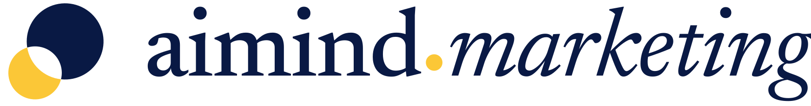
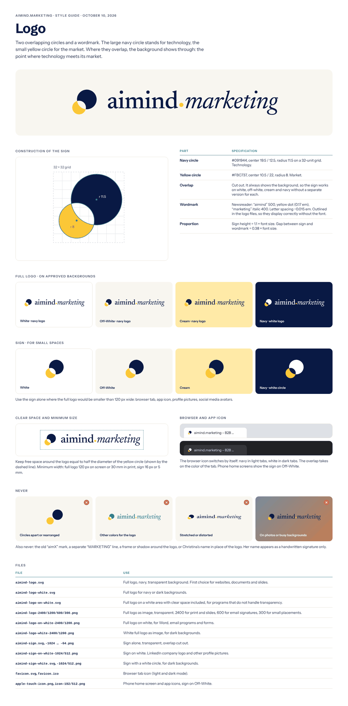
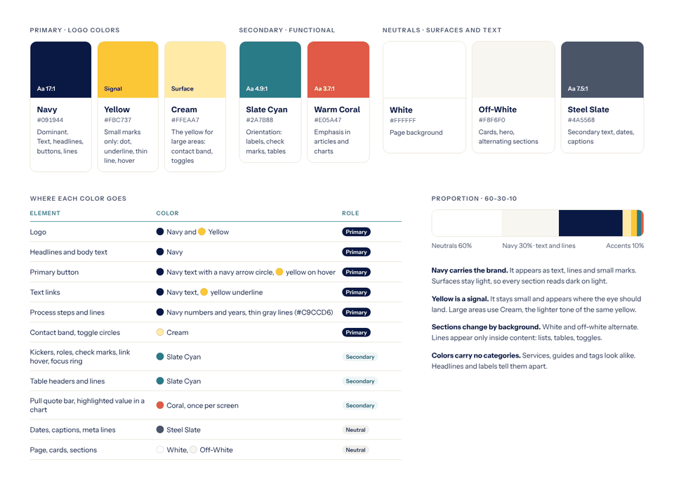
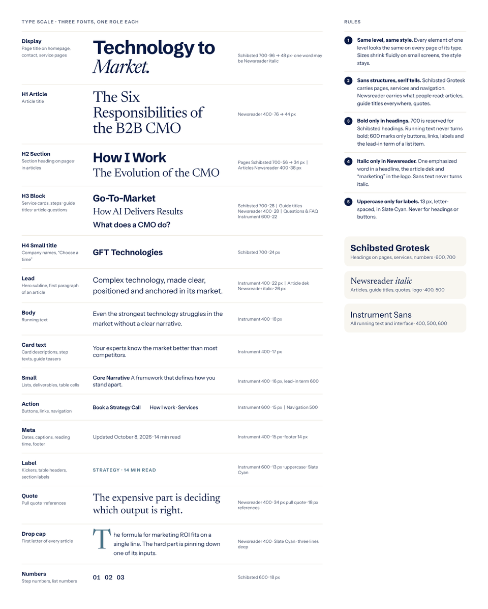
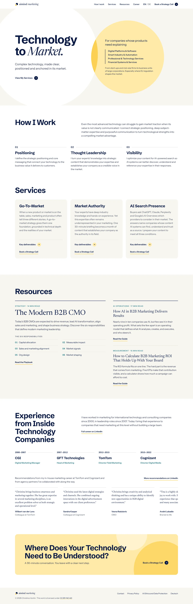
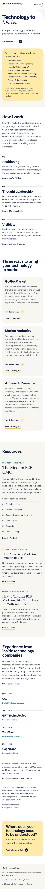
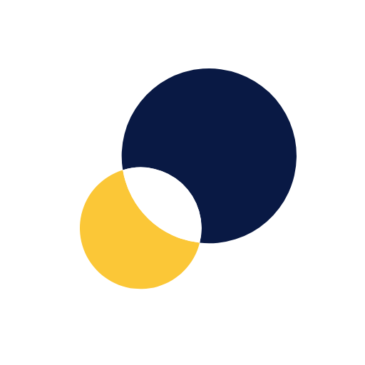
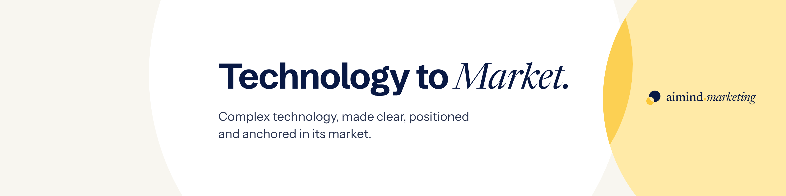
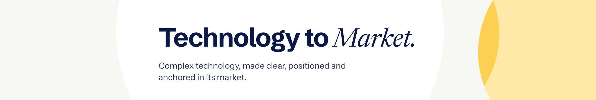

# aimind.marketing brand guide

Everything about the look of aimind.marketing in one place: logo, colors, fonts, page design and social media images. This page shows the visual overview. The binding rules in full are in [`docs/design-guide.md`](../docs/design-guide.md). The live code in `src/` is the reference; the test site is https://aimind-site.pages.dev/.

Last updated October 10, 2026.

**Contents** · [Logo](#logo) · [Colors](#colors) · [Typography](#typography) · [Pages](#pages) · [Social media](#social-media) · [How this guide stays current](#how-this-guide-stays-current)

---

## Logo



Two overlapping circles: navy for technology, yellow for the market. The overlap is cut out and always shows the background. Full guide with construction, clear space and examples of what not to do:

[](style-guide/logo.html)

| Use | File |
| --- | --- |
| Website, documents, slides | [`logo/svg/aimind-logo.svg`](logo/svg/aimind-logo.svg) |
| Dark or navy backgrounds | [`logo/svg/aimind-logo-white.svg`](logo/svg/aimind-logo-white.svg) |
| Word, email programs, forms | [`logo/png/aimind-logo-on-white-1200.png`](logo/png/aimind-logo-on-white-1200.png) |
| Email signature | [`logo/png/aimind-logo-600.png`](logo/png/aimind-logo-600.png) |
| Sign alone (small spaces) | [`logo/svg/aimind-sign.svg`](logo/svg/aimind-sign.svg) |
| Browser and app icons | `public/favicon.svg`, `favicon.ico`, `apple-touch-icon.png`, `icon-192.png`, `icon-512.png` |

All sizes: [`logo/svg/`](logo/svg/) and [`logo/png/`](logo/png/) (64 to 2400 px).

## Colors

[](style-guide/colors.html)

| Color | Hex | Use |
| --- | --- | --- |
| Navy | `#091944` | Text, headlines, buttons, lines. Never as a large surface. |
| Yellow | `#FBC737` | Small signals only: logo dot, link underline, hover. |
| Cream | `#FFEAA7` | The yellow for large areas: contact band, audience circle, toggles. |
| Slate Cyan | `#2A7B88` | Labels, check marks, table headers, drop cap. |
| Warm Coral | `#E05A47` | Rare emphasis in articles and charts. |
| White | `#FFFFFF` | Page background. |
| Off-White | `#F8F6F0` | Hero, cards, alternating sections. |
| Steel Slate | `#4A5568` | Secondary text, dates, captions. Body text: `#2B3550`. |

Rules in full: [design guide, section 3](../docs/design-guide.md#3-colors).

## Typography

[](style-guide/typography.html)

Three fonts, one role each: **Schibsted Grotesk** for headings on pages, **Newsreader** for everything people read as editorial content, **Instrument Sans** for running text and interface. Rules in full: [design guide, section 4](../docs/design-guide.md#4-typography).

## Pages

Screenshots of the current pages (October 10, 2026).

| Homepage desktop | Homepage phone |
| --- | --- |
|  |  |

More: [German homepage](screens/homepage-de-desktop.webp), [German phone](screens/homepage-de-phone.webp), [contact page](screens/contact-en-desktop.webp), [article](screens/article-en-desktop.webp). Layout, buttons and motion: [design guide, sections 5 to 7](../docs/design-guide.md#5-buttons-and-links).

## Social media

| | File | Size |
| --- | --- | --- |
|  | [Profile photo](social/christina-vontin-profile.jpg) | 760 × 760 |
|  | [LinkedIn company logo](social/linkedin-company-logo-512.png) | 512 × 512 |
|  | [LinkedIn profile banner](social/linkedin-profile-banner-1584x396.png) | 1584 × 396 |
|  | [LinkedIn company cover](social/linkedin-company-cover-1128x191.png) | 1128 × 191 |

Banners are exported at double resolution for sharp display; LinkedIn scales them down.

## How this guide stays current

- **Rules** live in [`docs/design-guide.md`](../docs/design-guide.md). Every design decision is written there first.
- **Boards** (`style-guide/*.html`) show the rules visually. Open them in a browser for the full page; GitHub shows the picture previews in `style-guide/previews/`.
- **After every design change**, Claude updates the rule, the matching board, its preview and, if pages changed, the screenshots in `screens/`.
- Only final versions live here. Explorations stay on the design canvas (https://claude.ai/artifact/9ysPDL1AqTgN52jaHjGVMY) as history.

```
design/
  README.md            this guide
  logo/svg, logo/png   logo set
  style-guide/         boards (HTML) and their previews (PNG)
  screens/             screenshots of the current pages
  social/              profile photo, LinkedIn logo, banners
```
